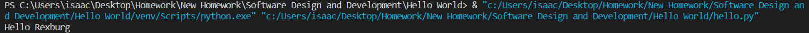

# Overview

Says Hello to Rexburg. Demonstrates an adept use of Python in Visual Studio Code.

# Development Environment

* Python 3.8.5
* Visual Studio Code

# Execution

To run: `python hello.py`

# Useful Websites

1. [Python Reference](https://docs.python.org/3/genindex-I.html)
2. [Stack Overflow Python Questions](https://stackoverflow.com/questions/tagged/python)